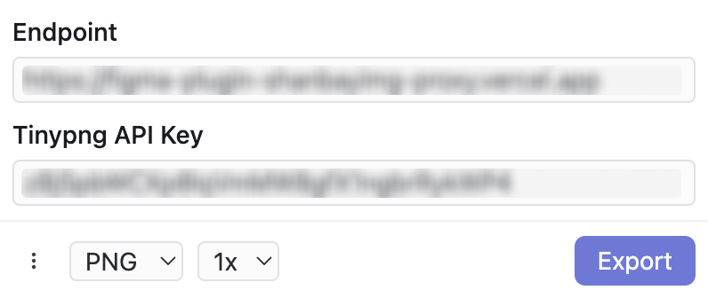

# AwesomeExport

An awesome Figma plugin for enhancing the image exporting.

- 🧠 Remember the last selected export options
- ✨ Absolute Bounds Mode
- 🐼 Support Tinypng compression

## Absolute Bounds Mode

Absolute Bounds Mode is different from Figma's default export method. It exports the frame containing the elements rather than the rendering box.

While holding down the Option key, the displayed frame is the one exported in Absolute Bounds Mode. If you use the exported assets for web UI development, the dimensions and distances to other elements will match those measured in Figma while holding down the Option key.

Therefore, Absolute Bounds Mode is the default in the plugin, but you can also disable it in the settings.

## Tinypng

If you have configured the [Tinypng API key](https://tinypng.com/developers), the plugin will utilize Tinypng to compress the exported image.

As Tinypng doesn't support cross-origin requests, the plugin forwards Tinypng API requests through a [cors-gateway](https://github.com/taterboom/cors-gateway). You can fork and set up your own endpoint.

## Data

- Export settings, Tinypng API key etc. are all saved locally.
- The [default endpoint](https://github.com/taterboom/cors-gateway) is an open-source API forwarding service that does not store any data. You can fork it and configure your own endpoint.
